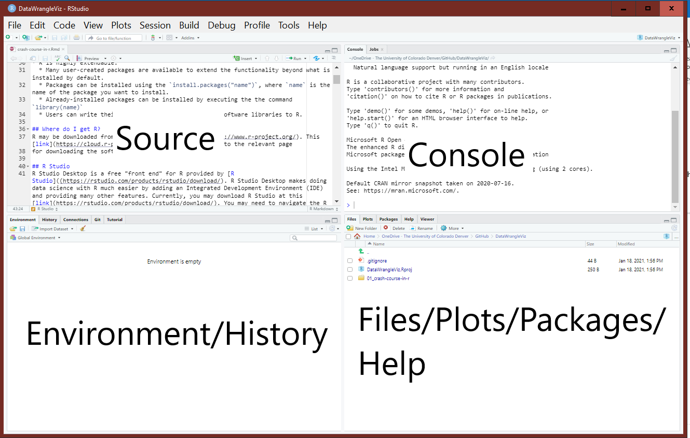
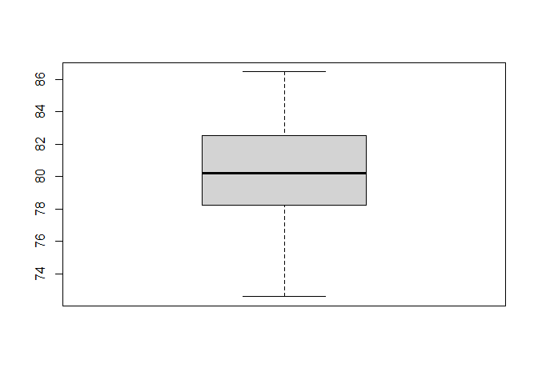
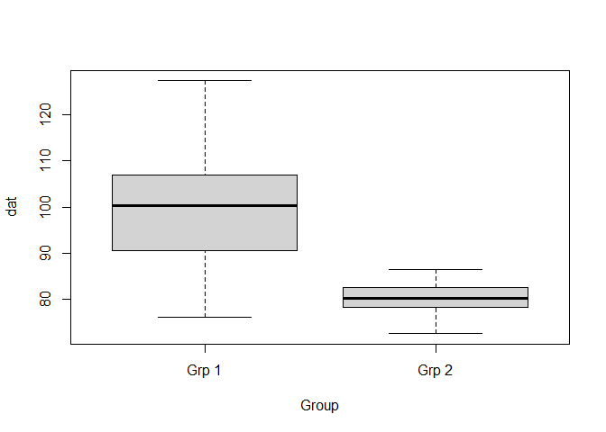
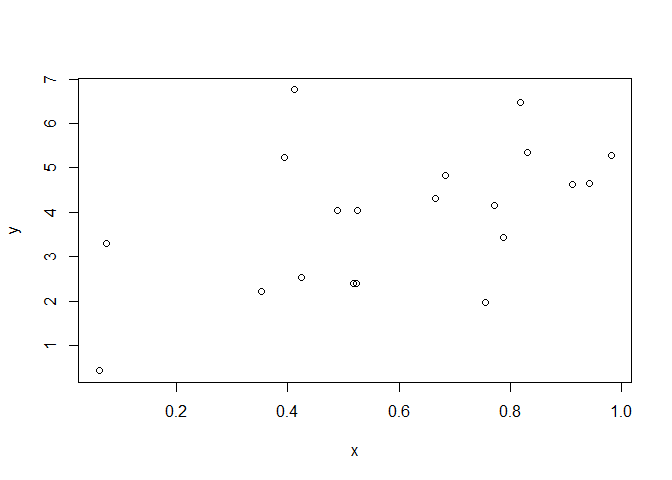
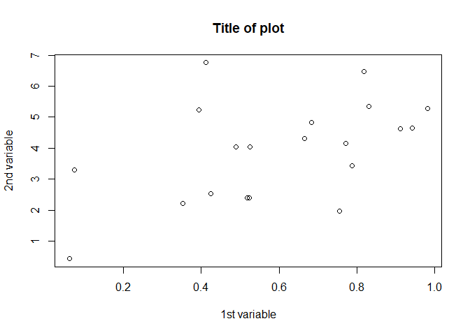
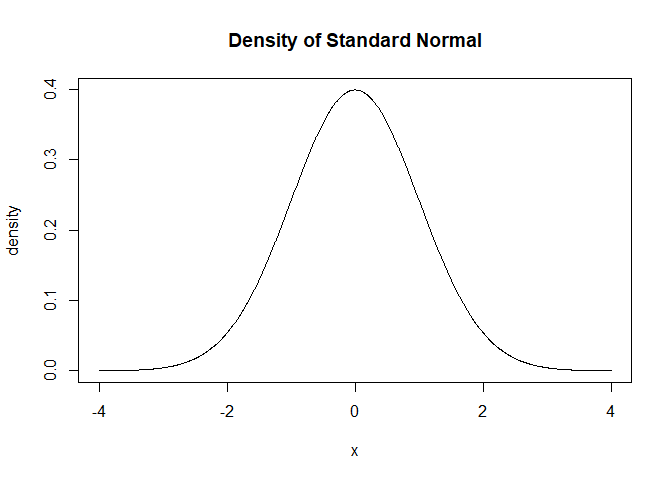
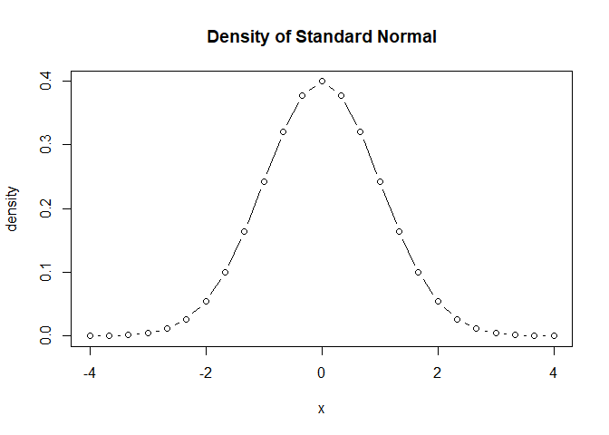
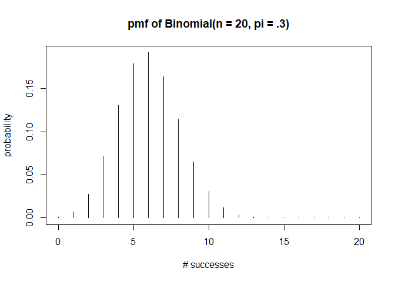

<style type="text/css">
.action {
    # margin: 2em;
    padding: 2em;
    border: 1px solid grey;
    border-radius: 5px;
    background: #eeeeee;
}
</style>

This notebook is intended to help you quickly learn how to productively
use R.

# Introduction

## What is R?

  - R is programming language and environment designed for statistical
    computing.
      - It is modeled after the *S* programming language.
      - It was introduced by Robert Gentleman and Robert Ihaka in 1993.
  - R is free, open source, and runs on Windows, Macs, Linux, and other
    types of computers.
  - R is an interactive programming language
      - You type and execute a command in the Console for immediate
        feedback in contrast to a compiled programming language, which
        compiles a program that is then executed.
  - R is highly extendable.
      - Many user-created packages are available to extend the
        functionality beyond what is installed by default.
      - Users can write their own functions and easily add software
        libraries to R.

## Where do I get R?

R may be downloaded from the R Project’s
[website](https://www.r-project.org/). This
[link](https://cloud.r-project.org/) *should* bring you to the relevant
page for downloading the software.

## R Studio

R Studio Desktop is a free “front end” for R provided by [R
Studio](https://rstudio.com/). R Studio Desktop makes doing data science
with R much easier by adding an Integrated Development Environment (IDE)
and providing many other features. Currently, you may download R Studio
at this [link](https://rstudio.com/products/rstudio/download/). You may
need to navigate the R Studio website directly.

R Studio has four panes:

1.  Source: the pane where you type your commands, which can be saved
    for later.
2.  Console: the pane where the code is executed.
3.  Environment/History: the pane where you can see all the objects in
    your workspace, your command history, and other things in other
    contexts.
4.  The Files/Plot/Packages/Help: the pane where you navigate between
    directories, where plots can be viewed, where you can see the
    packages available to be loaded, and where you can get help.



## Running code and scripts

Code is executed in R by typing it in the console and hitting enter.

### Your turn

Type `1+1` in the R Console and hit enter.

## Creating a new script

Instead of typing all of your code in the Console and hitting enter,
it’s better to write your code in a Script. The Script is just a text
file with all the commands you want to execute. A new script can be
obtained by executing File -\> New File -\> R Script or pressing “Ctrl +
Shift + n” (on a PC) or “Cmd + Shift + n” on a Mac.

### Your turn

Open a new Script in R Studio.

## Running code from a Script

There are various ways to run code from a Script file. The most common
ones are: 1. Highlight the code you want to run and hit the Run botton
at the top of the Script pane. 2. Highlight the code you want to run and
press “Ctrl + Enter” on your keyboard. If you don’t highlight anything,
by default, R Studio runs the command the cursor currently lies on.

### Your turn

Type `mean(c(1:3))` in your Script file.

Run the command using the approaches mentioned above.

## Saving a Script

To save a script, click File -\> Save or press “Ctrl + s” (on a PC) or
“Cmd + s” (on a Mac).

### Your turn

Save your script

## Packages

Packages are collections of functions, data, and other objects that
extend the functionality installed by default in R.

R packages can be installed using the `install.packages` function and
loaded using the `library` function.

## Your turn

The **tidyverse** <https://www.tidyverse.org> is an ecosystem of R
packages that we will use extensively in this class. Currently, the
**tidyverse** is comprised of the following packages:

  - **ggplot2** - A package for plotting based on the “Grammar of
    Graphics”.
  - **purrr** - A complete and consistent functional programming toolkit
    for R.
  - **tibble** - An advanced data frame.
  - **dplyr** - A grammar of data manipulation, providing a consistent
    set of verbs that help you solve the most common data manipulation
    challenge
  - **tidyr** - Tools to help to create tidy data, where each column is
    a variable, each row is an observation, and each cell contains a
    single value. ‘tidyr’ contains tools for changing the shape
    (pivoting) and hierarchy (nesting and ‘unnesting’) of a dataset,
    turning deeply nested lists into rectangular data frames
    (‘rectangling’), and extracting values out of string columns. It
    also includes tools for working with missing values (both implicit
    and explicit).
  - **stringr** - A package for working with character/string data.
  - **readr** - A package for importing data.
  - **forcats** - A package for working with categorical data.

Install the set of **tidyverse** R packages by executing the following
command:

``` r
install.packages("tidyverse")
```

After you install **tidyverse**, load the package(s) by executing the
following command:

``` r
library(tidyverse)
```

You should see something like this.

    ## -- Attaching packages --------------------------------------- tidyverse 1.3.0 --

    ## v ggplot2 3.3.2     v purrr   0.3.4
    ## v tibble  3.0.4     v dplyr   1.0.2
    ## v tidyr   1.1.2     v stringr 1.4.0
    ## v readr   1.4.0     v forcats 0.5.0

    ## Warning: package 'ggplot2' was built under R version 4.0.3

    ## Warning: package 'tibble' was built under R version 4.0.3

    ## Warning: package 'tidyr' was built under R version 4.0.3

    ## Warning: package 'readr' was built under R version 4.0.3

    ## Warning: package 'dplyr' was built under R version 4.0.3

    ## -- Conflicts ------------------------------------------ tidyverse_conflicts() --
    ## x dplyr::filter() masks stats::filter()
    ## x dplyr::lag()    masks stats::lag()

## Comments

A comment refers to internal documentation that the compiler/interpreter
should not execute. Comments are essentially reminders to yourself or
others about what the code is supposed to do, why you did it a certain
way, etc.

A comment is indicated by the `#` symbol. Nothing to the right of the
`#` is executed in the Console.

To comment (or uncomment) multiple lines in R, highlight the code you
want to comment and press “Ctrl + Shift + c” on a PC or “Cmd + Shift +
c” on a Mac.

An examples:

``` r
1 + 1 # adding 1 + 1
```

    ## [1] 2

``` r
# 2 + 2 (not adding 2 + 2 because of the #)
```

# Getting help

There are a number of helps to get help in R.

  - If you know the command for which you want help, then `?command`
    (where command is replaced the name of the relevant command) will
    bring up the documentation for the object.
      - This also may work with data sets, package names, object
        classes, etc.
  - If you need to find a command to help you with a certain *topic*,
    then `??topic` will search for the topic through all installed
    documentation and bring up any vignettes, code demonstrations, or
    help pages that include the topic for which you searched.
  - If you are trying to figure out why an error is being produced, what
    packages can be used to perform a certain analysis, how to perform a
    complex task that you can’t seem to figure out, etc., then simply do
    a web search for what you’re trying to figure out\! Because R is
    such a popular language, it is likely you will find a stackoverflow
    response, a blog, an R users forum response, etc., that at least
    partially addresses your question.

## Your turn

The `lm` command can be used to fit a linear model to a set of data. Use
`?lm` to get help about the `lm` function.

A [logarithm](https://www.dictionary.com/browse/logarithm?s=t) is, “The
exponent of the power to which a base number must be raised to equal a
given number.” e.g., \(\log_{10}(100)=2\) since \(10^2=100\). What
function is used to compute the *natural* logarithm (base
\(e\approx 2.718281828459\)) in R? Use `??logarithm` to find the R
functions that may provide this functionality.

Suppose you want to change the x-axis label of a plot in R. Do a web
search to see if you can figure out how to do this.

# Data types and structures

## Data types

R has 6 basic [data
types](https://swcarpentry.github.io/r-novice-inflammation/13-supp-data-structures/):

  - character
  - numeric (double)
  - integer
  - logical
  - complex

In addition to the five listed above, there is also raw which will not
be discussed.

## Data structures

R operates on data structures. A data structure is simply some sort of
“container” that holds certain kinds of information

R has 5 basic data structures:

  - vector
  - matrix
  - array
  - data frame
  - list

Vectors, matrices, and arrays are homogeneous objects that can only
store a single data type at a time.

Data frames and lists can store multiple data types

Vectors and lists are considered one-dimensional objects.

Matrices and data frames are considered two-dimensional objects.

Arrays can be n-dimensional objects.

This is summarized in the table below, which is based on a
[table](http://adv-r.had.co.nz/Data-structures.html#data-structure) in
the first edition of Hadley Wickham’s *Advanced R*.

| dimensionality | homogeneous | heterogeneous |
| :------------- | :---------- | :------------ |
| 1d             | vector      | list          |
| 2d             | matrix      | data frame    |
| nd             | array       |               |

## Vector basics

A *vector* is a single-dimensional set of data of the same type.

The most basic way to create a vector is the `c` function.

The `c` function combines values into a vector or list.

e.g., the following commands create vectors of type numeric, character,
and logical, respectively.

  - `c(1, 2, 5.3, 6, -2, 4)`
  - `c("one", "two", "three")`
  - `c(TRUE, TRUE, FALSE, TRUE)`

## Your turn

Execute the three commands above in the R Console to see what you get.

## Creating patterned vectors

R provides a number of functions for creating vectors following certain
consistent patterns.

The `seq` (sequence) function is used to create an equidistant series of
numeric values.

Some examples:

  - `seq(1, 10)`: A sequence of numbers from 1 to 10 in increments of 1.
  - `1:10`: A sequence of numbers from 1 to 10 in increments of 1.
  - `seq(1, 20, by = 2)`: A sequence of numbers from 1 to 20 in
    increments of 2.
  - `seq(10, 20, len = 100)`: A sequence of numbers from 10 to 20 of
    length 100.

The `rep` (replicate) function can be used to create a vector by
replicating values.

Some examples:

  - `rep(1:3, times = 3)`: Repeat the sequence 1, 2, 3 three times in a
    row.
  - `rep(c("trt1", "trt2", "trt3"), times = 1:3)`: Repeat “trt1” once,
    “trt2” twice, and “trt3” three times.
  - `rep(1:3, each = 3)`: Repeat each element of the sequence 1, 2, 3
    three times.

## Your turn

Execute the seven commands above in the R Console to see what you get.

## Assignment

To store a data structure in the computer’s memory we must assign it a
name.

Data structures can be stored using the assignment operator `<-` or `=`.

Some comments:

  - In general, both `<-` and `=` can be used for assignment.
  - Pressing the “Alt” and “-” keys simultaneously on a PC or Linux
    machine (Option and - on a Mac) will insert `<-` into the R console
    and script files (but not in R Markdown for some reason).
  - `<-` and `=` are NOT synonyms, but can be used identically most of
    the time.
  - In Section 8.2.26 of [*R
    Inferno*](http://www.burns-stat.com/pages/Tutor/R_inferno.pdf),
    Patrick Burns states, “Standard advice is to avoid using `=` when
    you mean `<-` even though it takes an extra keystroke. However, it
    is largely a matter of taste (as long as you know the differences).”
  - If you want to have your mind blown on the topic, you may read
    `?assignOps` or the stackoverflow thread
    [here](https://stackoverflow.com/questions/1741820/what-are-the-differences-between-and-assignment-operators-in-r).

As your instructor who cares about you, I recommend using the `<-`
operator for assignment. However, like a bad parent who doesn’t practice
what they preach, I will typically use the `=` operator because I’m lazy
and learned to program in C+, which like nearly all languages uses `=`
for assignment.

You *typically* won’t have issues with either assignement operator. But
when you do, you’ll be very upset.

Here’s an example of when you can have issues.

This code works:

``` r
system.time(result <- rnorm(100))
```

    ##    user  system elapsed 
    ##       0       0       0

The code above times (using `system.time`) how long it takes to draw 100
values from a standard normal distribution (`rnorm(100)`) and assign it
the name `result`.

This code doesn’t work:

``` r
system.time(result = rnorm(100))
```

    ## Error in system.time(result = rnorm(100)): unused argument (result = rnorm(100))

What’s the difference? In the second case, R thinks you are setting the
`result` argument of the `system.time` function (which doesn’t exist) to
the value produced by `rnorm(100)`.

A trivial examples of assignment: `v1 <- 1:5` assigns the sequence 1
through 5 the name `v1`.

To access the data assigned a name, we simply type the name into R and
hit enter.

``` r
v1 <- 1:5
v1
```

    ## [1] 1 2 3 4 5

Vectors can be combined and stored in an object using the `c` function
and the assignment operator.

We’ll create a new vector, `v2`, combine it with `v1` using the `c`
function, then assign it the name `new`.

``` r
v2 <- c(1, 10, 11)
new <- c(v1, v2)
new
```

    ## [1]  1  2  3  4  5  1 10 11

## Categorical vectors

Categorical data should be stored as a `factor` in R.

Hadley Wickham [states](https://adv-r.hadley.nz/vectors-chap.html) in
*Advanced R*, “A factor is a vector that can contain only predefined
values. It is used to store categorical data. Factors are built on top
of an integer vector with two attributes: a `class`, “factor”, which
makes it behave differently from regular integer vectors, and `levels`,
which defines the set of allowed values."

For the most part, you don’t need to worry about this. But remember that
if you have categorical data, you should represent it using as a
`factor`.

The `factor` function takes values that can be coerced to a character
and converts them to an object of class `factor`.

Some examples:

``` r
f1 <- factor(rep(1:6, times = 3))
f1
```

    ##  [1] 1 2 3 4 5 6 1 2 3 4 5 6 1 2 3 4 5 6
    ## Levels: 1 2 3 4 5 6

``` r
f2 <- factor(c("a", 7, "blue", "blue", FALSE))
f2
```

    ## [1] a     7     blue  blue  FALSE
    ## Levels: 7 a blue FALSE

## Your turn

Create a vector named `grp` that has two levels: `a` and `b`, where the
first 7 values are `a` and the second 4 values are `b`.

# Helpful functions

## General functions

  - `length(x)`: length of `x`
  - `sum(x)`: sum elements in `x`
  - `mean(x)`: sample mean of elements in `x`
  - `var(x)`: sample variance of elements in `x`
  - `sd(x)`: sample standard deviation of elements in `x`
  - `range(x)`: range (minimum and maximum) of elements in `x`
  - `log(x)`: (natural) logarithm of elements in `x`
  - `summary(x)`: a summary of `x`. Output changes depending on the
    class of `x`.
  - `str(x)`: provides information about the structure of `x`. Usually,
    the class of the object and some information about its size.

## Functions related to statistical distributions

Suppose that a random variable \(X\) has the `dist` distribution:

  - `p[dist](q, ...)`: returns the cdf of \(X\) evaluated at `q`, i.e.,
    \(p=P(X\leq q)\).
  - `q[dist](p, ...)`: returns the inverse cdf (or quantile function) of
    \(X\) evaluated at \(p\), i.e.,
    \(q = \inf\{x: P(X\leq x) \geq p\}\).
  - `d[dist](x, ...)`: returns the mass or density of \(X\) evaluated at
    \(x\) (depending on whether it’s discrete or continuous).
  - `r[dist](n, ...)`: returns an i.i.d. random sample of size `n`
    having the same distribution as \(X\).
  - The `...` indicates that additional arguments describing the
    parameters of the distribution may be required.

## Your turn

Execute the following commands in R to see the output.

  - `pnorm(1.96, mean = 0, sd = 1)` returns the probability that a
    normal random variable with mean 0 and standard deviation 1 is less
    than or equal to 1.96.
  - `qunif(0.6, min = 0, max = 1)` returns the value \(x\) such that
    \(P(X\leq x) = 0.6\) for a uniform random variable on the interval
    \([0, 1]\).
  - `dbinom(2, size = 20, prob = .2)` returns the probability that
    \(P(X=2)\)) for \(X∼\textrm{Binom}(n=20,\pi=0.2)\).
  - `dexp(1, rate = 2)` evaluates the density of an exponential random
    variable with mean = 1/2 at \(x=1\).
  - `rchisq(100, df = 5)` returns a sample of 100 observations from a
    chi-squared random variable with 5 degrees of freedom.

# Plotting with base

The plotting capabilities of R are one of its most powerful and
attractive features.

It is relatively simple to construct histograms, (parallel) boxplots,
scatterplots, etc.

Some examples:

  - A histogram is created using the `hist` function.
  - A boxplot is created using the `boxplot` function.
  - A scatterplot is created using the `plot` function.

## Histograms

A histogram with a custom x-axis label and title can be created using
the commands below. The x-axis label is customized using the `xlab`
argument and the title is customized using the `main` argument.

``` r
x <- rnorm(100, mean = 100, sd = 10) # generate some data
hist(x, xlab = "x-values",
    main = "Histogram of 100 observations from N(100, 10^2)")
```

<!-- -->

## Boxplots

A single boxplot can be created using the following commands:

``` r
y <- rnorm(100, mean = 80, sd = 3) # generate some data
boxplot(y)
```

<!-- -->

A set of parallel boxplots can be created by distinguishing numeric
values by a factor variable.

``` r
 #make groups for x and y
grp <- factor(rep(c("Grp 1", "Grp 2"), each = 100))
# combine x and y into a single vector
dat <- c(x, y)
boxplot(dat ~ grp, xlab = "Group")
```

<!-- -->

## Scatterplots

A scatterplot of two numeric vectors `x` and `y` can be created using
the notation `plot(x, y)` (with `x` on the x-axis and `y` on the y-axis)
or `plot(y ~ x)` (with `x` on the x-axis and `y` on the y-axis).

``` r
#generate vectors with a linear relationship
x <- runif(20)
y <- 2 + 3 * x + rnorm(20)
plot(x, y)
```

<!-- -->

``` r
plot(y ~ x)
```

<!-- -->

We can customize the x-axis and y-axis labels using `xlab` and `ylab`,
respectively. A title can be added after the fact using the `title`
function.

``` r
plot(x, y, xlab="1st variable", ylab="2nd variable")
title("Title of plot")
```

<!-- -->

The points of a scatterplot will be connected with a line (in the order
the points are provided) by specifying `type = "l"`. Specifying `type =
"b"` will display both the points and the line.

``` r
x <- seq(-4, 4, len = 1000)
y <- dnorm(x, mean = 0, sd = 1)
plot(x, y, xlab = "x", ylab = "density", type = "l")
title("Density of Standard Normal")
```

<!-- -->

``` r
x2 <- seq(-4, 4, len = 25)
y2 <- dnorm(x2, mean = 0, sd = 1)
plot(y2 ~ x2, xlab = "x", ylab = "density", type = "b")
title("Density of Standard Normal")
```

<!-- -->

To create histogram-like vertical lines, you can specify `type = "h"`.
This is useful for plotting the probability mass function of a random
variable. Consider the following example for a Binomial distribution
with \(n=20\) trials and probability of success \(\pi = 0.3\)..

``` r
x <- 0:20
y <- dbinom(x, size = 20, prob = .3)
plot(x, y, xlab = "# successes", ylab = "probability", type = "h")
title("pmf of Binomial(n = 20, pi = .3)")
```

<!-- -->

## Your turn

  - Use `?Distributions` to see the standard distributions included in
    R.
  - Draw 1000 observations from a Poisson distribution with a mean of 10
    and assign it the name `v`.
  - Use the `table` function to tabulate (as a continguency table) the
    values of `v` and store the tabulated values in an object called
    `tabv`.
      - `tabv` is a contingency table. The top row is an observed value
        in `v` and the bottow row is the number of observations with the
        value.
  - Use the `str` function to learn more about the structure of `tabv`.
  - Use the `plot` function on `tabv`. What do you get?
      - `plot` is actually a *generic* function. Many types of objects
        have a plot *method* associated with them. If you use `plot` of
        the object, then R produces a default plot of the object.
  - Use the `names` function to grab the names of the observed values in
    `v`. Assign this the name `value_char`.
  - Use the `str` function on `value_char` to confirm that this is a
    character vector.
  - Convert the `value_char` character vector to a numeric vector using
    the `as.numeric` function. Assign this the name `value`.
  - Convert `tabv` to a vector using the `as.vector` function and assign
    it the name `counts`.
  - Examine the structure of `counts`.
  - Construct a histogram of counts.
  - Construct a boxplot of counts.
  - Construct a histogram-like plot of counts using the `values`
    variable on the x-axis and the `counts` variable on the y-axis.

# Data Frames

Data frames are two-dimensional data objects. Each column of a data
frame is a vector (or variable) of possibly different data types. This
is a *fundamental* data structure used by most of R’s modeling software.

In general, I recommend *tidy data*, which means that each variable
forms a column of the data frame, and each observation forms a row.

Data frames are created by passing vectors into the `data.frame`
function.

The names of the columns in the data frame are the names of the vectors
you give the `data.frame` function.

Consider the following simple example.

``` r
d <- c(1, 2, 3, 4)
e <- c("red", "white", "blue", NA)
f <- c(TRUE, TRUE, TRUE, FALSE)
df <- data.frame(d,e,f)
df
```

    ##   d     e     f
    ## 1 1   red  TRUE
    ## 2 2 white  TRUE
    ## 3 3  blue  TRUE
    ## 4 4  <NA> FALSE

The columns of a data frame can be renamed using the `names` function on
the data frame.

``` r
names(df) <- c("ID", "Color", "Passed")
df
```

    ##   ID Color Passed
    ## 1  1   red   TRUE
    ## 2  2 white   TRUE
    ## 3  3  blue   TRUE
    ## 4  4  <NA>  FALSE

The columns of a data frame can be named when you are first creating the
data frame by using `name =` for each vector of data.

``` r
df2 <- data.frame(ID = d, Color = e, Passed = f)
df2
```

    ##   ID Color Passed
    ## 1  1   red   TRUE
    ## 2  2 white   TRUE
    ## 3  3  blue   TRUE
    ## 4  4  <NA>  FALSE

The vectors of a data frame may be accessed using `$` and specifying the
name of the desired vector.

Access the `Color` vector in `df`:

``` r
df$Color
```

    ## [1] "red"   "white" "blue"  NA

The vectors of a data frame may be accessed by specifying the desired
row(s) or column(s) in square brackets.

Access first row of `df`:

``` r
df[1,]
```

    ##   ID Color Passed
    ## 1  1   red   TRUE

Access third column of `df`:

``` r
df[,3]
```

    ## [1]  TRUE  TRUE  TRUE FALSE

You can similarly access vectors of a data frame and assign it a new
name.

Access the `ID` column of `df2` and assign it the name `newID`:

``` r
newID <- df2$ID
```

# Importing Data

The `read.table` function imports data from file into R as a data frame.

Usage: `read.table(file, header = TRUE, sep = ",")`

  - `file` is the file path and name of the file you want to import into
    R.
      - If you don’t know the file path, set `file = file.choose()` will
        bring up a dialog box asking you to locate the file you want to
        import.
  - `header` specifies whether the data file has a header (variable
    labels for each column of data in the first row of the data file).
      - If you don’t specify this option in R or use `header = FALSE`,
        then R will assume the file doesn’t have any headings.
      - `header = TRUE` tells R to read in the data as a data frame with
        column names taken from the first row of the data file.
  - `sep` specifies the delimiter separating elements in the file.
      - If each column of data in the file is separated by a space, then
        use `sep = " "`
      - If each column of data in the file is separated by a comma, then
        use `sep = ","`
      - If each column of data in the file is separated by a tab, then
        use `sep = "\t"`.

Here is an example reading a csv (comma separated file) with a header:

``` r
dtf <- read.table(file = "https://raw.githubusercontent.com/jfrench/DataWrangleViz/master/data/covid_dec4.csv",
                  header = TRUE,
                  sep = ",")
str(dtf)
```

    ## 'data.frame':    50 obs. of  7 variables:
    ##  $ state_name: chr  "Alabama" "Alaska" "Arizona" "Arkansas" ...
    ##  $ state_abb : chr  "AL" "AK" "AZ" "AR" ...
    ##  $ deaths    : int  3831 142 6885 2586 19582 2724 5146 782 19236 9725 ...
    ##  $ population: num  387000 96500 498000 238000 2815000 ...
    ##  $ income    : int  25734 35455 29348 25359 31086 35053 37299 32928 27107 28838 ...
    ##  $ hs        : num  82.1 91 85.6 82.9 80.7 89.7 88.6 87.7 85.5 84.3 ...
    ##  $ bs        : num  21.9 27.9 25.9 19.5 30.1 36.4 35.5 27.8 25.8 27.3 ...

# Accessing elements of a data structure with logical statements

Subsets of the elements of a vector may be selected by appending to the
name of the vector an index vector in square brackets `[]`.

Let’s create the numeric vector 2, 4, 6, 8, 10, 12, 14, 16.

``` r
a <- seq(2, 16, by = 2)
a
```

    ## [1]  2  4  6  8 10 12 14 16

Let’s access the 2nd, 4th, and 6th elements of `a`.

``` r
a[c(2, 4, 6)]
```

    ## [1]  4  8 12

Let’s access all elements in `a` EXCEPT the 2nd, 4th, and 6th using the
minus (`-`) sign in front of the index vector.

``` r
a[-c(2, 4, 6)]
```

    ## [1]  2  6 10 14 16

Let’s access all elements in `a` except elements 3 through 6.

``` r
a[-(3:6)]
```

    ## [1]  2  4 14 16

Sometimes we need to know if the elements of an object satisfy certain
conditions. This can be determined using the logical operators `<`,
`<=`, `>`, `>=`, `==`, `!=`.

Note that `==` means equal to and `!=` means not equal to.

## Your turn

Execute the following commands in R and see what you get. What is each
statement performing?

  - `a > 10`
  - `a <= 4`
  - `a == 10`
  - `a != 10`

## And and Or statements

More complicated logical statements can be made using `&` and `|`. \*
`&` means “and” \* `|` means “or”

## Your turn

Execute the following commands in R and see what you get. What is each
statement performing?

  - `(a > 6) & (a <= 10)`
  - `(a <= 4)|(a >= 12)`

## Logical statements and subsetting

Logical statements can be used to return parts of an object satisfying
the appropriate criteria. Specifically, we pass logical statements
within the square brackets used to access part of a data structure.

Some examples:

  - `a[a < 6]`: Return elements of a less than 6.
  - `a[a == 10]`: Return elements of a equal to 10.
  - `a[(a < 6)|(a == 10)]`: Return elements of a less than 6 or equal to
    10.

# Functions

A function is essentially a sequence of commands executed based on
certain arguments supplied to the function.

In R, a function is defined using the general format:

``` r
myfunction <- function(arg1, arg2, arg3) {
    code to execute
}
```

The name of the function is `myfunction`. To use this function, I type
the name of the function and supply the 3 arguments in parentheses in
the R Console, e.g., `myfunction(x1, x2, x3)`.

A function may or may not return something back that you can store for
later use.

Let’s perform an example of a function that returns the sample standard
deviation of a vector `x`. Recall that
\[SD(x) = \sqrt{\sum_{i=1}^n \frac{(x_i - \bar{x})^2}{n-1}}.\] The sole
argument is will be, `x`, a vector of numeric values.

``` r
stdev <- function(x) {
    s <- sqrt(sum((x - mean(x))^2)/(length(x) - 1))
    s
}
```

Let’s test our function against the `sd` function built into R.

Let’s generate some data:

``` r
z <- rnorm(20)
```

Let’s compute the sample standard deviation of `z` using the `sd`
function and the `stdev` function.

``` r
sd(z)
```

    ## [1] 0.9638778

``` r
stdev(z)
```

    ## [1] 0.9638778

## Your turn

Create a function that returns the density of a normal random variable
with mean `mu` and standard deviation `sigma` for a vector `x`. Recall
that the density function of a normal random variable is
\[f(x) = \frac{1}{\sigma \sqrt{2 \pi}} \exp\left(-\frac{1}{2 \sigma^2} (x - \mu)^2\right).\]

The arguments should be:

  - `x`: the vector of values at which I want to determine the density
  - `mu`, the mean of the normal distribution
  - `sigma`, the standard deviation of the normal distribution

## Function returning a list of results

Let’s do a simple example of a function that returns two pieces of
information using a `list`. We haven’t really talked about a list yet,
but we’ll learn more about them later.

Example: Create a function that returns the mean and standard deviation
of a vector x.

The sole argument will be, `x`, a vector of numeric values.

``` r
ms <- function(x) {
    m <- mean(x)
    s <- sd(x)
    return(list(m = m, s = s))
}
ms(z)
```

    ## $m
    ## [1] 0.2290953
    ## 
    ## $s
    ## [1] 0.9638778

``` r
ms_z <- ms(z)
ms_z$m
```

    ## [1] 0.2290953

``` r
ms_z[[1]]
```

    ## [1] 0.2290953

``` r
ms_z$s
```

    ## [1] 0.9638778

``` r
ms_z[[2]]
```

    ## [1] 0.9638778
